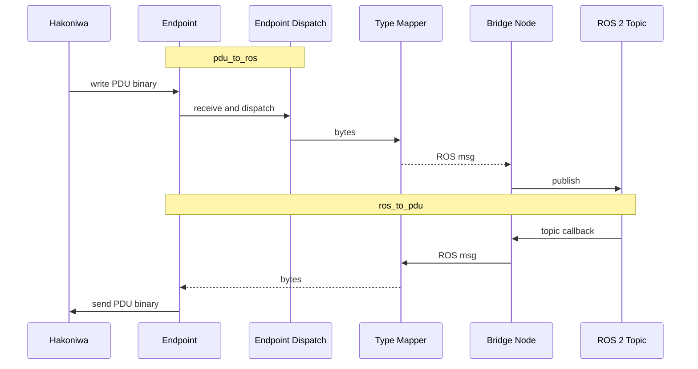

# Design

`hakoniwa-pdu-ros` の設計メモです。README では価値訴求と最短導入を優先し、
ここでは内部構成と設計意図を補足します。

## Responsibilities

- `hakoniwa-pdu-endpoint` Python bindings を PDU I/O 層として使う
- `pdudef.json` から `robot/pdu -> type/channel/size` を解決する
- `hakoniwa-pdu-python` generated converter を使って `PDU binary <-> pdu_pytype` を扱う
- `ROS message <-> pdu_pytype` を runtime で結ぶ

## Config Model

binding 設定は最小限です。

```json
{
  "endpoint_config": "endpoint_zenoh.json",
  "bindings": [
    {
      "pdu_key": {
        "robot_name": "Drone",
        "pdu_name": "pos"
      },
      "topic": "/hakoniwa/drone/pos"
    }
  ]
}
```

PDU 型、channel ID、payload size は `pdudef.json` から解決します。
`direction` を省略した binding は双方向です。片方向に制限したい場合だけ
`pdu_to_ros` または `ros_to_pdu` を明示します。

## Conversion Strategy

変換経路:

```text
ROS message <-> pdu_pytype object <-> PDU binary
```

責務分担:

- `hakoniwa-pdu-python`: `pdu_pytype <-> binary`
- `hakoniwa-pdu-ros`: `ROS message <-> pdu_pytype`

`hakoniwa-pdu-ros` は generated converter を前提にします。
converter が無い型は起動時に失敗させます。

利用する generated module:

- `hakoniwa_pdu.pdu_msgs.<pkg>.pdu_conv_<Msg>`
- `hakoniwa_pdu.pdu_msgs.<pkg>.pdu_pytype_<Msg>`

## Runtime Normalization

`hakoniwa-pdu-registry` の template に合わせて、runtime で次を吸収します。

- fixed primitive array が `tuple` で返る
- primitive `varray` が `bytearray` で返る
- `string` varray は `list[str]` で返る

`bytearray` の decode には ROS field metadata を使います。

対応済みの代表例:

- `sequence<uint8|int8>`
- `sequence<boolean>`
- `sequence<int16|uint16|int32|uint32|int64|uint64>`
- `sequence<float>`
- `sequence<double>`

## Main Modules

- `hakoniwa_pdu_ros/config_loader.py`
  binding 設定を読み、`pdudef.json` から型と channel 情報を補完する
- `hakoniwa_pdu_ros/pdu_definition.py`
  `hakoniwa-pdu-python` の `PduChannelConfig` を優先利用し、API 差分も吸収する
- `hakoniwa_pdu_ros/pdu_endpoint.py`
  `Endpoint` を包む薄い wrapper
- `hakoniwa_pdu_ros/type_mapper.py`
  generated converter と ROS message の間をつなぐ
- `hakoniwa_pdu_ros/bridge_node.py`
  双方向 binding、または明示された `pdu_to_ros` / `ros_to_pdu` を配線する ROS node

## Data Flow



## Threading

- ROS executor thread
  ROS callback を実行する
- endpoint dispatch thread
  PDU receive callback を Python 側で配送する
- transport thread
  raw I/O を処理する

transport thread は Python handler を直接実行しません。

## Verified Standard ROS Messages

常設テストで見ているのは次です。

- `sensor_msgs/PointCloud2`
- `sensor_msgs/JointState`
- `sensor_msgs/LaserScan`
- `sensor_msgs/CameraInfo`
- `std_msgs/Float64MultiArray`

これにより、nested message、fixed array、`string` varray、
primitive varray、payload array の代表パターンを押さえています。
