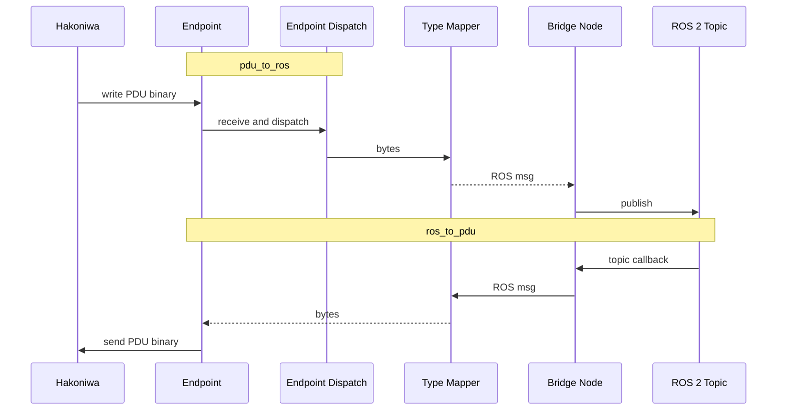

# Design

`hakoniwa-pdu-ros` の設計メモです。README では価値訴求と最短導入を優先し、
ここでは内部構成と設計意図を補足します。

## Detailed Protocol Specifications

Topic Bridgeの共通構成は本文書で扱う。ServiceとActionは独立したprotocol/runtime契約を
持つため、次を正本とする。

- [ROS 2 Service Bridge仕様](docs/spec-server.ja.md)
  - 方向非依存Binding
  - ROS Service Server／Client両Runtime
  - installed PDU-RPC generator境界
  - timeout/cancel/error契約
- [ROS 2 Action Goal lifecycle](docs/ros2-action-goal-lifecycle.ja.md)
- [ROS 2 Action user model](docs/ros2-action-user-model.ja.md)

READMEは導入と起動手順、本文書はTopic内部設計、各specはprotocol固有契約を担当する。

## Responsibilities

- `hakoniwa-pdu-endpoint` Python bindings を PDU I/O 層として使う
- `pdudef.json` から `robot/pdu -> type/channel/size` を解決する
- `hakoniwa-pdu-python` generated converter を使って `PDU binary <-> pdu_pytype` を扱う
- `ROS message <-> pdu_pytype` を runtime で結ぶ

## Config Model

binding 設定は最小限です。

```json
{
  "endpoint_config": "endpoint_zenoh.json",
  "bindings": [
    {
      "pdu_key": {
        "robot_name": "Drone",
        "pdu_name": "pos"
      }
    }
  ]
}
```

PDU 型、channel ID、payload size は `pdudef.json` から解決します。
`direction` と `topic` を省略した binding は、`/<robot>/<pdu>` を ROS 側 owner の
topic として、loader が次の2本の一方向 binding に展開します。

- `pdu_to_ros`: `/pdu/<robot>/<pdu>`
- `ros_to_pdu`: `/<robot>/<pdu>`

`topic` を指定した場合も、それは ROS 側 owner の topic 名です。PDU 側 owner の
topic は `/pdu<topic>` として導出します。bridge は `/pdu/...` を subscribe
しないため、PDU 由来の mirror に ROS 側から publish しても PDU 側には戻りません。
片方向に制限したい場合だけ `pdu_to_ros` または `ros_to_pdu` を明示します。
`/pdu` namespace を ROS 側 owner の `topic` として指定する config は、
feedback loop と誤用を避けるため起動前に拒否します。

### QoS Contract

binding の `qos` は任意です。省略時は、従来 `create_publisher()` /
`create_subscription()` に depth `10` を渡していた動作と同じになるよう、次を使います。

```json
{
  "history": "keep_last",
  "depth": 10,
  "reliability": "reliable",
  "durability": "volatile"
}
```

個別項目だけを指定した場合も、残りはこの既定値で補います。不明な項目、未対応の値、
正でない `depth` は起動前に拒否します。`direction` 省略で2本へ展開した binding には
同じ QoS を適用します。

設定値は `config_loader.py` の ROS 非依存な `QosConfig` として保持し、
`qos.py` でのみ `rclpy.qos.QoSProfile` へ変換します。これにより JSON 契約の検証を
ROS 2 未導入環境でもテストできます。

subscription 作成時には ROS 2 の incompatible QoS event callback を登録します。
実際の publisher と互換性がない場合、topic、要求 QoS、ROS 2 が通知した policy kind を
警告ログへ出します。通常のデータ callback や PDU 送信経路には影響させません。

## Conversion Strategy

変換経路:

```text
ROS message <-> pdu_pytype object <-> PDU binary
```

責務分担:

- `hakoniwa-pdu-python`: `pdu_pytype <-> binary`
- `hakoniwa-pdu-ros`: `ROS message <-> pdu_pytype`

`hakoniwa-pdu-ros` は generated converter を前提にします。
converter が無い型は起動時に失敗させます。

利用する generated module:

- `hakoniwa_pdu.pdu_msgs.<pkg>.pdu_conv_<Msg>`
- `hakoniwa_pdu.pdu_msgs.<pkg>.pdu_pytype_<Msg>`

## Runtime Normalization

`hakoniwa-pdu-registry` の template に合わせて、runtime で次を吸収します。

- fixed primitive array が `tuple` で返る
- primitive `varray` が `bytearray` で返る
- `string` varray は `list[str]` で返る
- rclpy の primitive sequence が `array.array` で渡される

`bytearray` の decode には ROS field metadata を使います。`array.array` は通常の
Python `list` へ変換してgenerated converterへ渡します。

ROS field metadata上はprimitive sequenceまたはfixed primitive arrayであるにも
かかわらず、値が`list`、`tuple`、`array.array`、対応済みbinary表現のいずれでも
ない場合は`TypeError`にします。未認識のsequence-like objectをstructとして再帰し、
値を無言で失うことを避けるためです。`numpy.ndarray`は現時点の契約には含めません。

対応済みの代表例:

- `sequence<uint8|int8>`
- `sequence<boolean>`
- `sequence<int16|uint16|int32|uint32|int64|uint64>`
- `sequence<float>`
- `sequence<double>`

## Main Modules

- `hakoniwa_pdu_ros/config_loader.py`
  binding 設定を読み、`pdudef.json` から型と channel 情報を補完する
- `hakoniwa_pdu_ros/pdu_definition.py`
  `hakoniwa-pdu-python` の `PduChannelConfig` を優先利用し、API 差分も吸収する
- `hakoniwa_pdu_ros/pdu_endpoint.py`
  `Endpoint` を包む薄い wrapper
- `hakoniwa_pdu_ros/type_mapper.py`
  generated converter と ROS message の間をつなぐ
- `hakoniwa_pdu_ros/qos.py`
  binding QoS の `rclpy` profile への変換と不整合診断 callback を提供する
- `hakoniwa_pdu_ros/bridge_node.py`
  loader が展開した一方向 binding を ROS publisher/subscription に配線する ROS node

## Data Flow


```mermaid
sequenceDiagram
    participant Sim as Hakoniwa
    participant EP as Endpoint
    participant AQ as Endpoint Dispatch
    participant TM as Type Mapper
    participant Node as Bridge Node
    participant ROS as ROS 2 Topic

    Note over EP,AQ: pdu_to_ros
    Sim->>EP: write PDU binary
    EP->>AQ: receive and dispatch
    AQ->>TM: bytes
    TM-->>Node: ROS msg
    Node->>ROS: publish

    Note over ROS,EP: ros_to_pdu
    ROS->>Node: topic callback
    Node->>TM: ROS msg
    TM-->>EP: bytes
    EP->>Sim: send PDU binary
```

## Threading

- ROS executor thread
  ROS callback を実行する
- endpoint dispatch thread
  PDU receive callback を Python 側で配送する
- transport thread
  raw I/O を処理する

transport thread は Python handler を直接実行しません。

## Verified Standard ROS Messages

常設テストで見ているのは次です。

- `sensor_msgs/PointCloud2`
- `sensor_msgs/JointState`
- `sensor_msgs/LaserScan`
- `sensor_msgs/CameraInfo`
- `std_msgs/Float64MultiArray`

これにより、nested message、fixed array、`string` varray、
primitive varray、payload array の代表パターンを押さえています。
