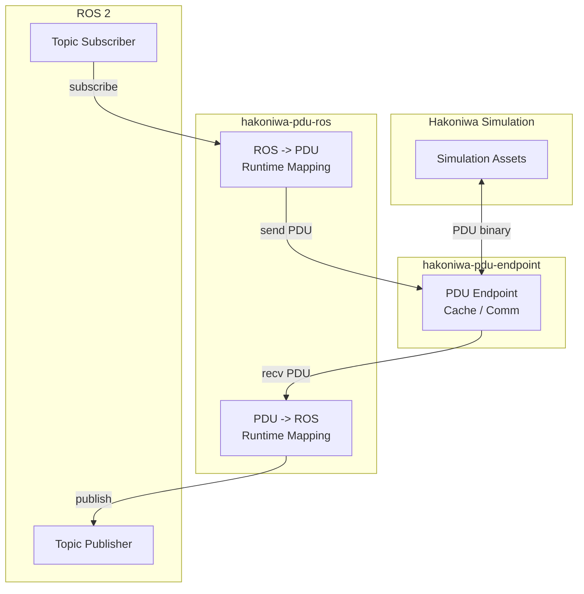

# hakoniwa-pdu-ros

[English](README.md)

**設定ファイルを書くだけで、Hakoniwa simulation と ROS 2 をつなげる。**

`hakoniwa-pdu-ros` は、Hakoniwa PDU と ROS 2 topic の間をつなぐ Python ブリッジです。
型ごとのブリッジコードは不要です。`pdudef.json` と binding JSON があれば、
`PDU <-> ROS` を実行時に解決します。

このブリッジは、`hakoniwa-pdu-endpoint` がサポートするすべての通信プロトコルに対応しています。
代表例としては、Zenoh、WebSocket、TCP/UDP などがあります。
このリポジトリでは、サンプル構成として Zenoh を使っています。

endpoint 側の通信機能や対応バックエンドの詳細は、こちらを参照してください。
[`hakoniwa-pdu-endpoint`](https://github.com/hakoniwalab/hakoniwa-pdu-endpoint)

- ブリッジ側のコード生成不要
- PDU 型から ROS message 型を自動解決
- endpoint の通信バックエンドに依存せず同じ仕組みで扱える
- 標準 ROS message で roundtrip テスト済み

## Why It Matters

PDU 型を追加するたびに、変換コードや専用ブリッジを書き直していませんか。
このリポジトリは、そのコストを runtime 側へ寄せます。

必要なのは次だけです。

1. `pdudef.json` に PDU 型を書く
2. endpoint 設定を書く
3. binding で `robot/pdu -> topic` を結ぶ

つまり、**PDU 定義ファイルさえあれば、ブリッジ側の追加実装なしで接続できる**
のがこのリポジトリの価値です。

しかも対象は 1 つの通信方式ではなく、`hakoniwa-pdu-endpoint` が扱う通信方式全体です。

## Architecture

この構成にしている理由は単純で、バイナリ layout の責務を
`hakoniwa-pdu-python` に寄せ、`hakoniwa-pdu-ros` は配線に集中するためです。
transport 自体は `hakoniwa-pdu-endpoint` に閉じ込めるので、bridge は通信方式非依存でいられます。



## How It Works

変換の責務は分離しています。

- `hakoniwa-pdu-python`: `pdu_pytype <-> PDU binary`
- `hakoniwa-pdu-ros`: `ROS message <-> pdu_pytype`

`hakoniwa-pdu-ros` はバイナリ layout を自前実装しません。代わりに、
`hakoniwa-pdu-python` の generated converter を使います。

- `hakoniwa_pdu.pdu_msgs.<pkg>.pdu_conv_<Msg>`
- `hakoniwa_pdu.pdu_msgs.<pkg>.pdu_pytype_<Msg>`

この方式により、ROS 側では「同じ名前のフィールドを再帰的に写す」だけで済みます。
この前提は `hakoniwa-pdu-registry` の generator template に合わせており、
generated converter の出力規則に沿って runtime を組んでいます。詳細は `DESIGN.md` を参照してください。

実運用上のポイント:

- fixed primitive array は `tuple` で返ることがある
- primitive `varray` は `bytearray` で返ることがある
- それらは ROS field metadata を見て runtime で正規化する

## Minimal Config

binding は最小限です。型、channel ID、サイズは `pdudef.json` から解決します。
`direction` と `topic` を省略すると、bridge は `/<robot>/<pdu>` を ROS 側 owner の
topic として使い、PDU 側 owner の mirror を `/pdu` 配下に自動生成します。

- `pdu_to_ros`: `/pdu/<robot>/<pdu>`
- `ros_to_pdu`: `/<robot>/<pdu>`

`topic` を指定した場合、それは ROS 側 owner の topic 名です。PDU 側 owner の topic は
その前に `/pdu` を付けて導出します。片方向にしたい場合だけ `direction` を指定します。
bridge は `/pdu/...` topic を subscribe しないので、ROS からそこへ publish しても
PDU 側には送信されません。

```json
{
  "endpoint_config": "endpoint_zenoh.json",
  "bindings": [
    {
      "pdu_key": {
        "robot_name": "Drone",
        "pdu_name": "pos"
      }
    },
    {
      "pdu_key": {
        "robot_name": "Drone",
        "pdu_name": "cmd"
      }
    }
  ]
}
```

## Verified Coverage

まずは標準 ROS message を常設テスト対象にしています。ここが通れば、
runtime mapping の中核はかなり信用できます。

検証済み:

- `sensor_msgs/PointCloud2`
- `sensor_msgs/JointState`
- `sensor_msgs/LaserScan`
- `sensor_msgs/CameraInfo`
- `std_msgs/Float64MultiArray`

テストコマンド:

```bash
python3 -m unittest discover -s test -p 'test_type_mapper.py'
```

## Ubuntu Quick Start

この quick start ではローカルで試しやすい Zenoh を使っています。ただし bridge 自体は
`hakoniwa-pdu-endpoint` を前提にしているので、同じ runtime mapping を他の通信バックエンドにも適用できます。
endpoint 側の transport の詳細は upstream の
[`hakoniwa-pdu-endpoint`](https://github.com/hakoniwalab/hakoniwa-pdu-endpoint)
を参照してください。

前提:

- Ubuntu 24.04
- ROS 2 導入済み
- `hakoniwa-pdu-endpoint` と `hakoniwa-pdu-ros` をローカルに checkout 済み
- Hakoniwa の apt リポジトリから `hakoniwa-core-full` を導入済み

この手順では、`hakoniwa-pdu-endpoint` だけをローカルでビルドする必要があります。
使う ROS 2 distribution を `ROS_DISTRO` に設定してください。例:

```bash
export ROS_DISTRO=${ROS_DISTRO:-jazzy}
```

### 1. Hakoniwa runtime パッケージを導入

ここで必要な runtime 依存は `hakoniwa-core-full` に含まれます。
Python 側の PDU runtime は、Hakoniwa の導入系を使うか、`pip install hakoniwa-pdu`
で直接入れられます。通常の quick start では、`hakoniwa-pdu-registry` を
個別に checkout する必要はありません。

```bash
echo "deb [trusted=yes] https://hakoniwalab.github.io/apt stable main" \
  | sudo tee /etc/apt/sources.list.d/hakoniwa.list

sudo apt update
sudo apt install -y hakoniwa-core-full

python3 -m venv ~/project/hakoniwa-pdu-venv
source ~/project/hakoniwa-pdu-venv/bin/activate
pip install -U pip
pip install hakoniwa-pdu
```

もし `hakoniwa-pdu` が Hakoniwa 環境側ですでに使える状態なら、上の `pip install`
は省略できます。

### 2. Build `hakoniwa-pdu-endpoint`

```bash
cd ~/project/hakoniwa-pdu-endpoint
python3 -m venv .venv-ffi
source .venv-ffi/bin/activate
pip install -U pip 'cffi==1.16.0'

cmake -S . -B build \
  -DHAKO_PDU_ENDPOINT_ENABLE_ZENOH=ON \
  -DBUILD_SHARED_LIBS=ON \
  -DCMAKE_POSITION_INDEPENDENT_CODE=ON
cmake --build build -j4

python3 python/hakoniwa_pdu_endpoint/build_c_endpoint_ffi.py
```

確認:

```bash
find build/python -name '_c_endpoint_ffi*'
```

### 3. Build `hakoniwa-pdu-ros`

```bash
export ROS_DISTRO=${ROS_DISTRO:-jazzy}
source /opt/ros/${ROS_DISTRO}/setup.bash
source ~/project/hakoniwa-pdu-venv/bin/activate
export HAKONIWA_PDU_ENDPOINT_PYTHON_PATH=~/project/hakoniwa-pdu-endpoint/build/python

mkdir -p ~/project/ros2_ws/src
ln -s ~/project/hakoniwa-pdu-ros ~/project/ros2_ws/src/hakoniwa-pdu-ros

cd ~/project/ros2_ws
colcon build
source install/setup.bash
```

`HAKONIWA_PDU_ENDPOINT_PYTHON_PATH` は `build/python` を向けるのが推奨です。
`hakoniwa-pdu-ros` 側で sibling の `python/` も自動追加します。

もしインストール済みの `hakoniwa-pdu` ではなく、ローカル checkout の
`hakoniwa-pdu-python` を開発用に使いたい場合は、次を追加してください。

```bash
export HAKONIWA_PDU_PYTHON_PATH=/path/to/hakoniwa-pdu-python/src
```

### 4. Start the Bridge

```bash
export ROS_DISTRO=${ROS_DISTRO:-jazzy}
source /opt/ros/${ROS_DISTRO}/setup.bash
source ~/project/hakoniwa-pdu-venv/bin/activate
source ~/project/ros2_ws/install/setup.bash

export HAKONIWA_PDU_ENDPOINT_PYTHON_PATH=~/project/hakoniwa-pdu-endpoint/build/python

ros2 run hakoniwa_pdu_ros bridge \
  --config ~/project/hakoniwa-pdu-ros/config/sample/sample_binding.json
```

bridge は `peer_listen`、example 側は `peer_connect` です。

### 5. Check `Zenoh -> ROS`

ROS subscriber:

```bash
export ROS_DISTRO=${ROS_DISTRO:-jazzy}
source /opt/ros/${ROS_DISTRO}/setup.bash
source ~/project/ros2_ws/install/setup.bash
python3 ~/project/hakoniwa-pdu-ros/examples/ros_pos_subscriber.py
```

Zenoh peer:

```bash
export ROS_DISTRO=${ROS_DISTRO:-jazzy}
source /opt/ros/${ROS_DISTRO}/setup.bash
source ~/project/hakoniwa-pdu-venv/bin/activate
export HAKONIWA_PDU_ENDPOINT_PYTHON_PATH=~/project/hakoniwa-pdu-endpoint/build/python
python3 ~/project/hakoniwa-pdu-ros/examples/zenoh_peer.py
```

あるいは:

```bash
ros2 topic echo /hakoniwa/drone/pos
```

### 6. Check `ROS -> Zenoh`

```bash
export ROS_DISTRO=${ROS_DISTRO:-jazzy}
source /opt/ros/${ROS_DISTRO}/setup.bash
source ~/project/hakoniwa-pdu-venv/bin/activate
source ~/project/ros2_ws/install/setup.bash
python3 ~/project/hakoniwa-pdu-ros/examples/ros_cmd_publisher.py
```

`zenoh_peer.py` 側に `Drone/cmd` が表示されれば成功です。

## Troubleshooting

- `ModuleNotFoundError: hakoniwa_pdu_endpoint._c_endpoint_ffi`
  cffi module 未生成、または `HAKONIWA_PDU_ENDPOINT_PYTHON_PATH` が `build/python` を向いていません。
- `ModuleNotFoundError: hakoniwa_pdu_endpoint.c_endpoint`
  wrapper source が import path に入っていません。`build/python` を指定してください。
- `LinkError ... recompile with -fPIC`
  `hakoniwa-pdu-endpoint` を `-DBUILD_SHARED_LIBS=ON -DCMAKE_POSITION_INDEPENDENT_CODE=ON` 付きで再ビルドしてください。
- `open failed: err=3`
  bridge と example の両方が `listen` になっています。bridge は `endpoint_zenoh.json`、example は `endpoint_zenoh_connect.json` を使います。
- `WARNING: No subscribers found for Robot: ...`
  その endpoint インスタンスに対応 callback がありません。sample config では `notify_on_recv` を direction に合わせて絞っています。
- `config/sample/` を変えたのに挙動が変わらない
  `ros2 run` は `install/.../share/...` の設定を使います。`colcon build` し直してください。

## More

- English README: [README.md](README.md)
- examples: [examples/README.md](examples/README.md)
- design details: [DESIGN.md](DESIGN.md)
