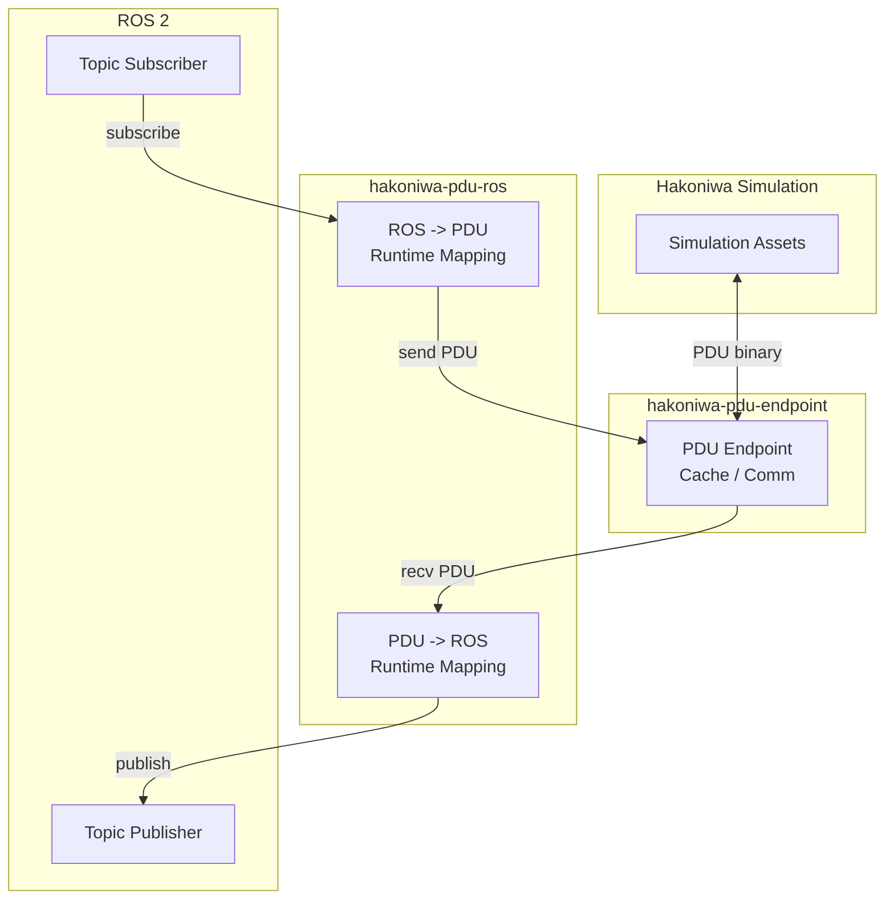

# hakoniwa-pdu-ros

[English](README.md)

**設定ファイルを書くだけで、Hakoniwa simulation と ROS 2 をつなげる。**

`hakoniwa-pdu-ros` は、Hakoniwa PDU と ROS 2 topic の間をつなぐ Python ブリッジです。
型ごとのブリッジコードは不要です。`pdudef.json` と binding JSON があれば、
`PDU <-> ROS` を実行時に解決します。

このブリッジは、`hakoniwa-pdu-endpoint` がサポートするすべての通信プロトコルに対応しています。
代表例としては、Zenoh、WebSocket、TCP/UDP などがあります。
このリポジトリでは、サンプル構成として Zenoh を使っています。

endpoint 側の通信機能や対応バックエンドの詳細は、こちらを参照してください。
[`hakoniwa-pdu-endpoint`](https://github.com/hakoniwalab/hakoniwa-pdu-endpoint)

- ブリッジ側のコード生成不要
- PDU 型から ROS message 型を自動解決
- endpoint の通信バックエンドに依存せず同じ仕組みで扱える
- 標準 ROS message で roundtrip テスト済み

## Why It Matters

PDU 型を追加するたびに、変換コードや専用ブリッジを書き直していませんか。
このリポジトリは、そのコストを runtime 側へ寄せます。

必要なのは次だけです。

1. `pdudef.json` に PDU 型を書く
2. endpoint 設定を書く
3. binding で `robot/pdu -> topic` を結ぶ

つまり、**PDU 定義ファイルさえあれば、ブリッジ側の追加実装なしで接続できる**
のがこのリポジトリの価値です。

しかも対象は 1 つの通信方式ではなく、`hakoniwa-pdu-endpoint` が扱う通信方式全体です。

## Architecture

この構成にしている理由は単純で、バイナリ layout の責務を
`hakoniwa-pdu-python` に寄せ、`hakoniwa-pdu-ros` は配線に集中するためです。
transport 自体は `hakoniwa-pdu-endpoint` に閉じ込めるので、bridge は通信方式非依存でいられます。


```mermaid
flowchart TB
    subgraph Hakoniwa ["Hakoniwa Simulation"]
        sim[Simulation Assets]
    end

    subgraph Endpoint ["hakoniwa-pdu-endpoint"]
        ep[PDU Endpoint\nCache / Comm]
    end

    subgraph Bridge ["hakoniwa-pdu-ros"]
        direction LR
        conv_in[PDU -> ROS\nRuntime Mapping]
        conv_out[ROS -> PDU\nRuntime Mapping]
    end

    subgraph ROS ["ROS 2"]
        topic_pub[Topic Publisher]
        topic_sub[Topic Subscriber]
    end

    sim <-->|PDU binary| ep
    ep -->|recv PDU| conv_in
    conv_in -->|publish| topic_pub
    topic_sub -->|subscribe| conv_out
    conv_out -->|send PDU| ep
```

## How It Works

変換の責務は分離しています。

- `hakoniwa-pdu-python`: `pdu_pytype <-> PDU binary`
- `hakoniwa-pdu-ros`: `ROS message <-> pdu_pytype`

`hakoniwa-pdu-ros` はバイナリ layout を自前実装しません。代わりに、
`hakoniwa-pdu-python` の generated converter を使います。

- `hakoniwa_pdu.pdu_msgs.<pkg>.pdu_conv_<Msg>`
- `hakoniwa_pdu.pdu_msgs.<pkg>.pdu_pytype_<Msg>`

この方式により、ROS 側では「同じ名前のフィールドを再帰的に写す」だけで済みます。
この前提は `hakoniwa-pdu-registry` の generator template に合わせており、
generated converter の出力規則に沿って runtime を組んでいます。詳細は `DESIGN.md` を参照してください。

実運用上のポイント:

- fixed primitive array は `tuple` で返ることがある
- primitive `varray` は `bytearray` で返ることがある
- rclpy の primitive sequence は `array.array` で渡されることがある
- それらは ROS field metadata を見て runtime で正規化する
- primitive sequence と宣言されたfieldに未対応の値が来た場合は、無言で値を捨てず
  明示的にエラーにする

## Minimal Config

binding は最小限です。型、channel ID、サイズは `pdudef.json` から解決します。
`direction` と `topic` を省略すると、bridge は `/<robot>/<pdu>` を ROS 側 owner の
topic として使い、PDU 側 owner の mirror を `/pdu` 配下に自動生成します。

- `pdu_to_ros`: `/pdu/<robot>/<pdu>`
- `ros_to_pdu`: `/<robot>/<pdu>`

| Owner | ROS topic | bridge の動作 | 主な使い方 |
| --- | --- | --- | --- |
| ROS | `<topic>` | subscribe して PDU 側へ送信 | ROS から Hakoniwa/PDU へ command や値を送る |
| PDU | `/pdu/<topic>` | PDU 側から受信して publish | Hakoniwa/PDU 側 owner の値を ROS で読む |

`topic` を指定した場合、それは ROS 側 owner の topic 名です。PDU 側 owner の topic は
その前に `/pdu` を付けて導出します。片方向にしたい場合だけ `direction` を指定します。
bridge は `/pdu/...` topic を subscribe しないので、ROS からそこへ publish しても
PDU 側には送信されません。
展開後の ROS topic は一意である必要があります。同じ ROS topic に複数 binding が
割り当たる config は bridge が拒否します。

各 binding には ROS 2 QoS を任意指定できます。`BEST_EFFORT` を使う
`/joint_states` などの sensor publisher を購読する場合に使用します。

```json
{
  "pdu_key": {
    "robot_name": "Tobas",
    "pdu_name": "joint_states"
  },
  "direction": "ros_to_pdu",
  "topic": "/joint_states",
  "qos": {
    "history": "keep_last",
    "depth": 10,
    "reliability": "best_effort",
    "durability": "volatile"
  }
}
```

指定できる値と既定値は次のとおりです。

| 項目 | 値 | 既定値 |
| --- | --- | --- |
| `history` | `keep_last`, `keep_all` | `keep_last` |
| `depth` | 正の整数 | `10` |
| `reliability` | `reliable`, `best_effort` | `reliable` |
| `durability` | `volatile`, `transient_local` | `volatile` |

`qos` を省略した場合は従来の bridge と同じ動作です。`direction` を省略して
双方向へ展開する場合、同じ QoS 設定を両方向へ適用します。`depth` は常に正の整数を
指定しますが、`history` が `keep_all` の場合は ROS 2 では使用されません。

bridge は起動時に各 publisher/subscription の解決済み QoS をログへ出します。
subscription に対して ROS 2 が publisher QoS の不整合を通知した場合は、
topic と要求 QoS を含む警告を出します。

```json
{
  "endpoint_config": "endpoint_zenoh.json",
  "bindings": [
    {
      "pdu_key": {
        "robot_name": "Drone",
        "pdu_name": "pos"
      }
    },
    {
      "pdu_key": {
        "robot_name": "Drone",
        "pdu_name": "cmd"
      }
    }
  ]
}
```

Zenoh comm config の `zenoh.io` は binding config から生成できます。
endpoint 側の receive 設定と binding がズレないように、次のコマンドで更新してください。

```bash
python3 -m hakoniwa_pdu_ros.gen_zenoh_io binding.json --comm comm.json --write
```

bridge は起動時に `zenoh.io` を検証し、binding と一致しない場合はこの生成コマンドを表示します。
これにより `notify_on_recv` のズレも検出できます。

## ROS Service設定generator

ROS Service BridgeはTopic Bridgeとは別Nodeとして構築します。方向非依存の一つの
Service Bindingを両方向で共有します。Runtime entry point名の`server` / `client`はROS側の
役割を表し、Bindingには`kind` fieldを持たせません。
Service Bindingの正本と
AddTwoIntsの例は次にあります。

- `schema/service-binding.schema.json`
- `config/service/add_two_ints.json`
- [`docs/spec-server.ja.md`](docs/spec-server.ja.md)

generatorはinstalled ROS `.srv`、`hakoniwa-pdu`のgenerated型、Hakoniwa offsetを解決し、
抽象Service manifestをinstalled `hakoniwa-pdu-rpc` generatorへ渡します。RPC generatorが
client名、channel、Endpoint、queue、TCP/tcp_muxを含むServer/Client用設定を生成します。これらの出力名はPDU-RPC側の
役割を表し、ROS側のRuntime方向とは独立しています。解決したPDU package/typeはService Nodeにも
そのまま渡されるため、Runtimeが既定packageだけを再探索することはありません。

```bash
python3 -m hakoniwa_pdu_ros.generate_service_config \
  --config config/service/add_two_ints.json \
  --offset-dir /path/to/share/hakoniwa/offset
```

既定の出力先:

```text
build/generated/service/add_two_ints/
├── hakoniwa-service.json
├── rpc-server-services.json
├── rpc-client-services.json
├── endpoints/
└── transport/
```

Business Packから利用する場合は、`--output-dir`へ
`work/recipes/<recipe-id>/config/service`を指定します。client名は
`hakoniwa_pdu_ros_<service-key>_<index>`形式で生成され、channel IDはserviceごとに
request `0`、response `1`から連続採番されます。

`--offset-dir`を省略した場合は`HAKO_BINARY_PATH`を使用します。両方とも利用できない場合は、
暗黙のsystem pathへfallbackせずエラーにします。

ROS Service Server Nodeは次のCLIで起動します。起動時にBindingからRPC設定を生成し、
serviceごとに`max_clients`個のTyped RPC Client poolを作ります。

```bash
service-server \
  --config config/service/add_two_ints.json \
  --offset-dir /path/to/share/hakoniwa/offset \
  --rpc-library /path/to/libhakoniwa_pdu_rpc.so
```

同じBindingを使い、ROS Service Client / Hakoniwa Typed RPC Server方向は次で起動します。

```bash
service-client \
  --config config/service/add_two_ints.json \
  --offset-dir /path/to/share/hakoniwa/offset \
  --rpc-library /path/to/libhakoniwa_pdu_rpc.so
```

この方向では生成済みserver Endpointを`RpcMuxServer`が使用し、箱庭RPC RequestをROS
`call_async()`へ渡します。`kind`や別Bindingは不要です。

`--rpc-library`省略時は`HAKO_PDU_RPC_LIBRARY`を使用します。ROS callbackは
`TypedRpcClient.call_async()`の完了を`rclpy` Futureへ渡すため、同期RPC待ちでexecutorを
ブロックしません。起動ログにはROS service名・ROS型・Hakoniwa RPC service名・解決済みPDU型・
自動生成client名の範囲・timeoutが表示されます。

`timeout_msec`はBridgeが一元管理する期限です。内部PDU-RPC呼び出しは
`timeout_usec=0`（無期限待ち）で開始し、期限到達時はPDU-RPCの通常cancel経路を使います。
これによりBridgeとRPC native timeoutからcancelが二重発行される競合を防ぎます。
その後に正常応答が競合して到着してもROS成功応答へ変換しません。RPCがterminal stateへ
到達してからclientをpoolへ戻すため、late responseが次の要求へ混入しません。

Docker native testでは、Core不要のEndpointとPDU-RPCをビルドし、生成設定を使って
AddTwoInts RPC ServerとTyped `call_async()` Clientを実TCP接続します。

```bash
bash test/docker/run_native_tests.sh
```

このテストにはHakoniwa RPC基準環境に加え、実際のROS 2 ClientからService Server Nodeを経由する
AddTwoIntsの正常応答、連続呼び出し、4件の並列呼び出しと5件目の`BUSY`拒否、timeout後の
late response破棄とclient再利用のE2Eも含まれます。RPC Server側は複数の独立接続を受ける
Python `RpcMuxServer`と`tcp_mux` transportを使用します。要求処理中のshutdownについても、
RPC cancel、terminal cleanup、pool close、ROS応答を合成しないことまで確認します。
request/response変換エラーについても、変換方向とservice識別情報をログに出し、client leaseを
解放し、ROS応答を合成せず、Service Nodeが継続することを確認します。
逆方向も、実際の箱庭Typed RPC ClientからService Client NodeとROS 2 Service Serverを経由して
2回連続で`42`を取得するE2Eを含みます。

RPC Server、Service Bridge、`ros2 service call`を三つのターミナルで個別に起動して観測するには、
[ROS Service手動デモ](examples/service/README.ja.md)を参照してください。

## ROS Action Bridge

Action Bridgeは方向を持たない一つのBindingを、両方向のRuntimeで共用します。
entry point名はROS側から見た役割を表します。

| entry point | ROS側の役割 | Hakoniwa PDU-RPC側の役割 | 使用Endpoint |
| --- | --- | --- | --- |
| `action-server` | Action Server | Typed Action Client | `client_endpoint` |
| `action-client` | Action Client | Typed Action Server | `server_endpoint` |

正本となるSchemaとFibonacci例は次のとおりです。

- `schema/action-binding.schema.json`
- `config/action/fibonacci.json`
- `config/action/fibonacci-transport.json`
- [`task-action.md`](task-action.md)

共通のHakoniwa Action Runtime設定を一度生成します。

```bash
python3 -m hakoniwa_pdu_ros.generate_action_config \
  --config config/action/fibonacci.json \
  --output-dir build/generated/action/fibonacci
```

同じBindingと生成物を、どちらの方向でも利用できます。

```bash
# Hakoniwa Action ServerをROS 2 Action Serverとして公開する。
action-server \
  --config config/action/fibonacci.json \
  --output-dir build/generated/action/fibonacci \
  --rpc-library /path/to/libhakoniwa_pdu_rpc.so

# Hakoniwa Action ClientからROS 2 Action Serverへ接続する。
action-client \
  --config config/action/fibonacci.json \
  --output-dir build/generated/action/fibonacci \
  --rpc-library /path/to/libhakoniwa_pdu_rpc.so
```

`--rpc-library`省略時は`HAKO_PDU_RPC_LIBRARY`を使用します。
`--output-dir`省略時は`build/generated/action/<binding-id>`へ生成します。
Business Pack Recipeから使う場合は、Recipe-localなconfigディレクトリを明示します。

ユーザーが指定するのは意味的なBindingとTransportの2ファイルだけです。channel ID、
packet名、slot routing、解決済みAction Runtime設定はPDU-RPCのgenerator契約で生成します。
raw packet、Header、slot、Protocol状態は`hakoniwa-pdu-rpc`内に閉じ、ROS側ではtypedな
Goal／Feedback／Result bodyの変換と、双方のGoal Handleの相関だけを担当します。

Docker native testは実TCPを使って両方向を検証します。Action Client Bridge方向では
ROS Fibonacci Action Serverを起動し、Hakoniwa Goalのaccept／reject、Feedback、
terminal Result、Cancelのaccept／rejectを確認します。

```bash
bash test/docker/run_native_tests.sh
```

## Verified Coverage

まずは標準 ROS message を常設テスト対象にしています。ここが通れば、
runtime mapping の中核はかなり信用できます。

検証済み:

- `sensor_msgs/PointCloud2`
- `sensor_msgs/JointState`
- `sensor_msgs/LaserScan`
- `sensor_msgs/CameraInfo`
- `std_msgs/Float64MultiArray`

テストコマンド:

```bash
python3 -m unittest discover -s test -p 'test_type_mapper.py'
```

## Ubuntu Quick Start

この quick start ではローカルで試しやすい Zenoh を使っています。ただし bridge 自体は
`hakoniwa-pdu-endpoint` を前提にしているので、同じ runtime mapping を他の通信バックエンドにも適用できます。
endpoint 側の transport の詳細は upstream の
[`hakoniwa-pdu-endpoint`](https://github.com/hakoniwalab/hakoniwa-pdu-endpoint)
を参照してください。

前提:

- Ubuntu 24.04
- ROS 2 導入済み
- `hakoniwa-pdu-endpoint` と `hakoniwa-pdu-ros` をローカルに checkout 済み
- Hakoniwa の apt リポジトリから `hakoniwa-core-full` を導入済み

この手順では、`hakoniwa-pdu-endpoint` だけをローカルでビルドする必要があります。
使う ROS 2 distribution を `ROS_DISTRO` に設定してください。例:

```bash
export ROS_DISTRO=${ROS_DISTRO:-jazzy}
```

### 1. Hakoniwa runtime パッケージを導入

ここで必要な runtime 依存は `hakoniwa-core-full` に含まれます。
Python 側の PDU runtime は、Hakoniwa の導入系を使うか、`pip install hakoniwa-pdu`
で直接入れられます。通常の quick start では、`hakoniwa-pdu-registry` を
個別に checkout する必要はありません。

```bash
echo "deb [trusted=yes] https://hakoniwalab.github.io/apt stable main" \
  | sudo tee /etc/apt/sources.list.d/hakoniwa.list

sudo apt update
sudo apt install -y hakoniwa-core-full

python3 -m venv ~/project/hakoniwa-pdu-venv
source ~/project/hakoniwa-pdu-venv/bin/activate
pip install -U pip
pip install hakoniwa-pdu
```

もし `hakoniwa-pdu` が Hakoniwa 環境側ですでに使える状態なら、上の `pip install`
は省略できます。

### 2. Build `hakoniwa-pdu-endpoint`

```bash
cd ~/project/hakoniwa-pdu-endpoint
python3 -m venv .venv-ffi
source .venv-ffi/bin/activate
pip install -U pip 'cffi==1.16.0'

cmake -S . -B build \
  -DHAKO_PDU_ENDPOINT_ENABLE_ZENOH=ON \
  -DBUILD_SHARED_LIBS=ON \
  -DCMAKE_POSITION_INDEPENDENT_CODE=ON
cmake --build build -j4

python3 python/hakoniwa_pdu_endpoint/build_c_endpoint_ffi.py
```

確認:

```bash
find build/python -name '_c_endpoint_ffi*'
```

### 3. Build `hakoniwa-pdu-ros`

```bash
export ROS_DISTRO=${ROS_DISTRO:-jazzy}
source /opt/ros/${ROS_DISTRO}/setup.bash
source ~/project/hakoniwa-pdu-venv/bin/activate
export HAKONIWA_PDU_ENDPOINT_PYTHON_PATH=~/project/hakoniwa-pdu-endpoint/build/python

mkdir -p ~/project/ros2_ws/src
ln -s ~/project/hakoniwa-pdu-ros ~/project/ros2_ws/src/hakoniwa-pdu-ros

cd ~/project/ros2_ws
colcon build
source install/setup.bash
```

`HAKONIWA_PDU_ENDPOINT_PYTHON_PATH` は `build/python` を向けるのが推奨です。
`hakoniwa-pdu-ros` 側で sibling の `python/` も自動追加します。

もしインストール済みの `hakoniwa-pdu` ではなく、ローカル checkout の
`hakoniwa-pdu-python` を開発用に使いたい場合は、次を追加してください。

```bash
export HAKONIWA_PDU_PYTHON_PATH=/path/to/hakoniwa-pdu-python/src
```

### 4. Start the Bridge

```bash
export ROS_DISTRO=${ROS_DISTRO:-jazzy}
source /opt/ros/${ROS_DISTRO}/setup.bash
source ~/project/hakoniwa-pdu-venv/bin/activate
source ~/project/ros2_ws/install/setup.bash

export HAKONIWA_PDU_ENDPOINT_PYTHON_PATH=~/project/hakoniwa-pdu-endpoint/build/python

ros2 run hakoniwa_pdu_ros bridge \
  --config ~/project/hakoniwa-pdu-ros/config/sample/sample_binding.json
```

bridge は `peer_listen`、example 側は `peer_connect` です。

### 5. Check `Zenoh -> ROS`

ROS subscriber:

```bash
export ROS_DISTRO=${ROS_DISTRO:-jazzy}
source /opt/ros/${ROS_DISTRO}/setup.bash
source ~/project/ros2_ws/install/setup.bash
python3 ~/project/hakoniwa-pdu-ros/examples/ros_pos_subscriber.py
```

Zenoh peer:

```bash
export ROS_DISTRO=${ROS_DISTRO:-jazzy}
source /opt/ros/${ROS_DISTRO}/setup.bash
source ~/project/hakoniwa-pdu-venv/bin/activate
export HAKONIWA_PDU_ENDPOINT_PYTHON_PATH=~/project/hakoniwa-pdu-endpoint/build/python
python3 ~/project/hakoniwa-pdu-ros/examples/zenoh_peer.py
```

あるいは:

```bash
ros2 topic echo /pdu/hakoniwa/drone/pos
```

### 6. Check `ROS -> Zenoh`

```bash
export ROS_DISTRO=${ROS_DISTRO:-jazzy}
source /opt/ros/${ROS_DISTRO}/setup.bash
source ~/project/hakoniwa-pdu-venv/bin/activate
source ~/project/ros2_ws/install/setup.bash
python3 ~/project/hakoniwa-pdu-ros/examples/ros_cmd_publisher.py
```

`zenoh_peer.py` 側に `Drone/cmd` が表示されれば成功です。

## Troubleshooting

- `ModuleNotFoundError: hakoniwa_pdu_endpoint._c_endpoint_ffi`
  cffi module 未生成、または `HAKONIWA_PDU_ENDPOINT_PYTHON_PATH` が `build/python` を向いていません。
- `ModuleNotFoundError: hakoniwa_pdu_endpoint.c_endpoint`
  wrapper source が import path に入っていません。`build/python` を指定してください。
- `LinkError ... recompile with -fPIC`
  `hakoniwa-pdu-endpoint` を `-DBUILD_SHARED_LIBS=ON -DCMAKE_POSITION_INDEPENDENT_CODE=ON` 付きで再ビルドしてください。
- `open failed: err=3`
  bridge と example の両方が `listen` になっています。bridge は `endpoint_zenoh.json`、example は `endpoint_zenoh_connect.json` を使います。
- `WARNING: No subscribers found for Robot: ...`
  その endpoint インスタンスに対応 callback がありません。sample config では双方向 bridge で使う sample PDU の `notify_on_recv` を有効にしています。
- `config/sample/` を変えたのに挙動が変わらない
  `ros2 run` は `install/.../share/...` の設定を使います。`colcon build` し直してください。

## More

- English README: [README.md](README.md)
- examples: [examples/README.md](examples/README.md)
- design details: [DESIGN.md](DESIGN.md)
