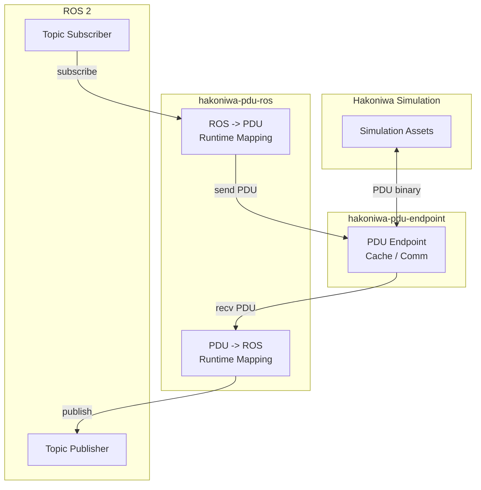

# hakoniwa-pdu-ros

[日本語版](README.ja.md)

**Connect Hakoniwa simulation and ROS 2 with configuration files only.**

`hakoniwa-pdu-ros` is a Python bridge between Hakoniwa PDU data and ROS 2 topics.
You do not need to write per-type bridge code. If you have `pdudef.json` and a
binding JSON file, the bridge resolves `PDU <-> ROS` at runtime.

This bridge supports all communication protocols provided by
`hakoniwa-pdu-endpoint`. Representative examples include Zenoh, WebSocket,
and TCP/UDP. In this repository, Zenoh is used as the sample configuration.

For the endpoint-side communication features and supported backends, see:
[`hakoniwa-pdu-endpoint`](https://github.com/hakoniwalab/hakoniwa-pdu-endpoint)

- No bridge-side code generation
- ROS message types are resolved automatically from the PDU definition
- The same mechanism works across endpoint communication backends
- Roundtrip-tested with standard ROS messages

## Why It Matters

Are you rewriting conversion code every time you add a new PDU type?
This repository moves that cost into the runtime.

You only need:

1. A `pdudef.json` that defines the PDU type
2. An endpoint configuration
3. A binding that maps `robot/pdu -> topic`

In other words, **if the PDU definition exists, you can connect it without
adding new bridge-side implementation**.

That includes not only one transport, but the communication protocols already
handled by `hakoniwa-pdu-endpoint`.

## Architecture

This structure keeps binary layout responsibility inside
`hakoniwa-pdu-python`, while `hakoniwa-pdu-ros` focuses on wiring.
The transport itself stays in `hakoniwa-pdu-endpoint`, so the bridge remains
transport-agnostic.



## How It Works

Responsibilities are split cleanly:

- `hakoniwa-pdu-python`: `pdu_pytype <-> PDU binary`
- `hakoniwa-pdu-ros`: `ROS message <-> pdu_pytype`

`hakoniwa-pdu-ros` does not implement binary layouts itself. Instead, it uses
generated converters from `hakoniwa-pdu-python`:

- `hakoniwa_pdu.pdu_msgs.<pkg>.pdu_conv_<Msg>`
- `hakoniwa_pdu.pdu_msgs.<pkg>.pdu_pytype_<Msg>`

This means the ROS side only needs recursive field-name mapping.
That assumption is aligned with the generator templates in
`hakoniwa-pdu-registry`, and the runtime is built around the output rules of
those generated converters. See `DESIGN.md` for details.

Important runtime details:

- fixed primitive arrays may come back as `tuple`
- primitive `varray` values may come back as `bytearray`
- those values are normalized at runtime using ROS field metadata

## Minimal Config

The binding stays intentionally small. Type, channel ID, and payload size are
resolved from `pdudef.json`.

```json
{
  "endpoint_config": "endpoint_zenoh.json",
  "bindings": [
    {
      "pdu_key": {
        "robot_name": "Drone",
        "pdu_name": "pos"
      },
      "direction": "pdu_to_ros",
      "topic": "/hakoniwa/drone/pos"
    },
    {
      "pdu_key": {
        "robot_name": "Drone",
        "pdu_name": "cmd"
      },
      "direction": "ros_to_pdu",
      "topic": "/hakoniwa/drone/cmd"
    }
  ]
}
```

## Verified Coverage

The permanent test target is standard ROS messages first. If these pass, the
core runtime mapping is already in good shape.

Verified:

- `sensor_msgs/PointCloud2`
- `sensor_msgs/JointState`
- `sensor_msgs/LaserScan`
- `sensor_msgs/CameraInfo`
- `std_msgs/Float64MultiArray`

Test command:

```bash
python3 -m unittest discover -s test -p 'test_type_mapper.py'
```

## Ubuntu Quick Start

This quick start uses Zenoh because it is easy to demonstrate locally. The
bridge itself is designed around `hakoniwa-pdu-endpoint`, so the same runtime
mapping applies to other endpoint communication backends as well.
For endpoint-side transport details, refer to the upstream repository:
[`hakoniwa-pdu-endpoint`](https://github.com/hakoniwalab/hakoniwa-pdu-endpoint)

Assumptions:

- Ubuntu 24.04
- ROS 2 is already installed
- `hakoniwa-pdu-endpoint` and `hakoniwa-pdu-ros` are checked out locally
- `hakoniwa-core-full` is installed from the Hakoniwa apt repository

For this setup, only `hakoniwa-pdu-endpoint` needs to be built locally.
Set `ROS_DISTRO` to the ROS 2 distribution you want to use, for example:

```bash
export ROS_DISTRO=${ROS_DISTRO:-jazzy}
```

### 1. Install Hakoniwa runtime packages

`hakoniwa-core-full` provides the runtime dependencies used here, including
the registry assets. For the Python-side PDU runtime, you can either use the
package installed through Hakoniwa tooling or install it directly with `pip`.
You do not need a separate local checkout of `hakoniwa-pdu-registry` for the
normal quick start.

```bash
echo "deb [trusted=yes] https://hakoniwalab.github.io/apt stable main" \
  | sudo tee /etc/apt/sources.list.d/hakoniwa.list

sudo apt update
sudo apt install -y hakoniwa-core-full

python3 -m venv ~/project/hakoniwa-pdu-venv
source ~/project/hakoniwa-pdu-venv/bin/activate
pip install -U pip
pip install hakoniwa-pdu
```

If `hakoniwa-pdu` is already available through your Hakoniwa environment, you
can skip the `pip install` step above.

### 2. Build `hakoniwa-pdu-endpoint`

```bash
cd ~/project/hakoniwa-pdu-endpoint
python3 -m venv .venv-ffi
source .venv-ffi/bin/activate
pip install -U pip 'cffi==1.16.0'

cmake -S . -B build \
  -DHAKO_PDU_ENDPOINT_ENABLE_ZENOH=ON \
  -DBUILD_SHARED_LIBS=ON \
  -DCMAKE_POSITION_INDEPENDENT_CODE=ON
cmake --build build -j4

python3 python/hakoniwa_pdu_endpoint/build_c_endpoint_ffi.py
```

Check:

```bash
find build/python -name '_c_endpoint_ffi*'
```

### 3. Build `hakoniwa-pdu-ros`

```bash
export ROS_DISTRO=${ROS_DISTRO:-jazzy}
source /opt/ros/${ROS_DISTRO}/setup.bash
source ~/project/hakoniwa-pdu-venv/bin/activate
export HAKONIWA_PDU_ENDPOINT_PYTHON_PATH=~/project/hakoniwa-pdu-endpoint/build/python

mkdir -p ~/project/ros2_ws/src
ln -s ~/project/hakoniwa-pdu-ros ~/project/ros2_ws/src/hakoniwa-pdu-ros

cd ~/project/ros2_ws
colcon build
source install/setup.bash
```

Point `HAKONIWA_PDU_ENDPOINT_PYTHON_PATH` to `build/python`.
`hakoniwa-pdu-ros` also adds the sibling `python/` directory automatically.

If you are developing against a local `hakoniwa-pdu-python` checkout instead of
the installed `hakoniwa-pdu` package, set:

```bash
export HAKONIWA_PDU_PYTHON_PATH=/path/to/hakoniwa-pdu-python/src
```

### 4. Start the Bridge

```bash
export ROS_DISTRO=${ROS_DISTRO:-jazzy}
source /opt/ros/${ROS_DISTRO}/setup.bash
source ~/project/hakoniwa-pdu-venv/bin/activate
source ~/project/ros2_ws/install/setup.bash

export HAKONIWA_PDU_ENDPOINT_PYTHON_PATH=~/project/hakoniwa-pdu-endpoint/build/python

ros2 run hakoniwa_pdu_ros bridge \
  --config ~/project/hakoniwa-pdu-ros/config/sample/sample_binding.json
```

The bridge side uses `peer_listen`. The example side uses `peer_connect`.

### 5. Check `Zenoh -> ROS`

ROS subscriber:

```bash
export ROS_DISTRO=${ROS_DISTRO:-jazzy}
source /opt/ros/${ROS_DISTRO}/setup.bash
source ~/project/ros2_ws/install/setup.bash
python3 ~/project/hakoniwa-pdu-ros/examples/ros_pos_subscriber.py
```

Zenoh peer:

```bash
export ROS_DISTRO=${ROS_DISTRO:-jazzy}
source /opt/ros/${ROS_DISTRO}/setup.bash
source ~/project/hakoniwa-pdu-venv/bin/activate
export HAKONIWA_PDU_ENDPOINT_PYTHON_PATH=~/project/hakoniwa-pdu-endpoint/build/python
python3 ~/project/hakoniwa-pdu-ros/examples/zenoh_peer.py
```

Or:

```bash
ros2 topic echo /hakoniwa/drone/pos
```

### 6. Check `ROS -> Zenoh`

```bash
export ROS_DISTRO=${ROS_DISTRO:-jazzy}
source /opt/ros/${ROS_DISTRO}/setup.bash
source ~/project/hakoniwa-pdu-venv/bin/activate
source ~/project/ros2_ws/install/setup.bash
python3 ~/project/hakoniwa-pdu-ros/examples/ros_cmd_publisher.py
```

If `Drone/cmd` appears on the `zenoh_peer.py` side, the path is working.

## Troubleshooting

- `ModuleNotFoundError: hakoniwa_pdu_endpoint._c_endpoint_ffi`
  The cffi module is not built yet, or `HAKONIWA_PDU_ENDPOINT_PYTHON_PATH`
  does not point to `build/python`.
- `ModuleNotFoundError: hakoniwa_pdu_endpoint.c_endpoint`
  The wrapper source is missing from import resolution. Point the env var to
  `build/python`.
- `LinkError ... recompile with -fPIC`
  Rebuild `hakoniwa-pdu-endpoint` with
  `-DBUILD_SHARED_LIBS=ON -DCMAKE_POSITION_INDEPENDENT_CODE=ON`.
- `open failed: err=3`
  Both sides are trying to `listen`. The bridge must use
  `endpoint_zenoh.json`, and the example must use
  `endpoint_zenoh_connect.json`.
- `WARNING: No subscribers found for Robot: ...`
  The endpoint instance received a PDU that has no local callback registered.
  In the sample config, `notify_on_recv` is trimmed to match the actual
  consumed direction.
- Behavior did not change after editing `config/sample/`
  `ros2 run` uses files under `install/.../share/...`. Re-run `colcon build`.

## More

- Japanese README: [README.ja.md](README.ja.md)
- examples: [examples/README.md](examples/README.md)
- design details: [DESIGN.md](DESIGN.md)
