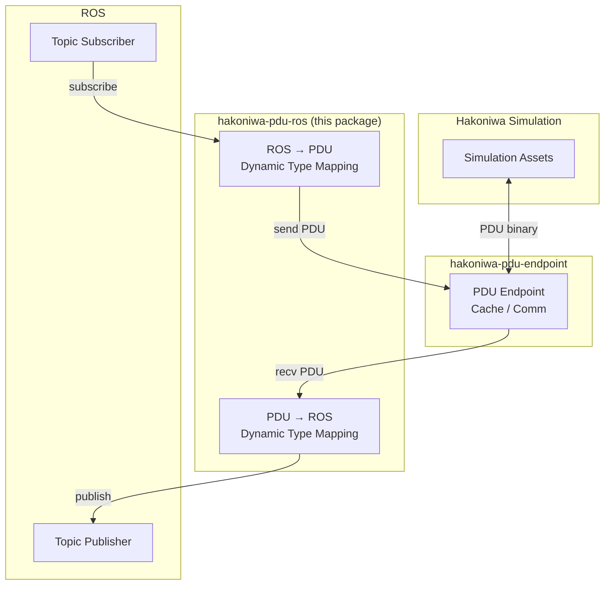

# hakoniwa-pdu-ros

**hakoniwa-pdu-ros** is a lightweight Python bridge between [hakoniwa-pdu-endpoint](https://github.com/hakoniwalab/hakoniwa-pdu-endpoint) and ROS topics.

## Overview

This package dynamically maps Hakoniwa PDU data to ROS topic messages and vice versa — no code generation required.

- **PDU → ROS**: Loads a `hakoniwa-pdu-endpoint`, receives incoming PDU data, and dynamically converts it into the corresponding ROS topic message.
- **ROS → PDU**: Subscribes to ROS topics and forwards the received messages directly into the endpoint.

Thanks to Python's dynamic typing, PDU fields are mapped to ROS message fields at runtime, keeping the bridge flexible and configuration-driven.

## Architecture

