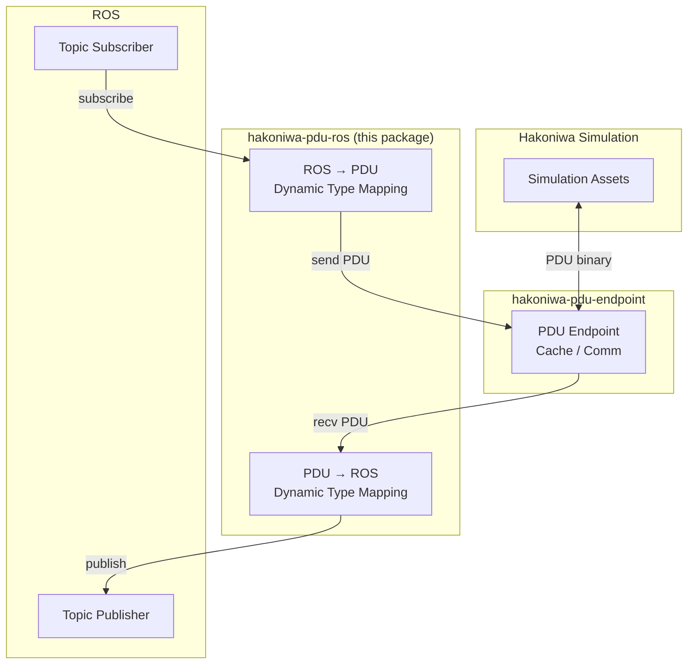
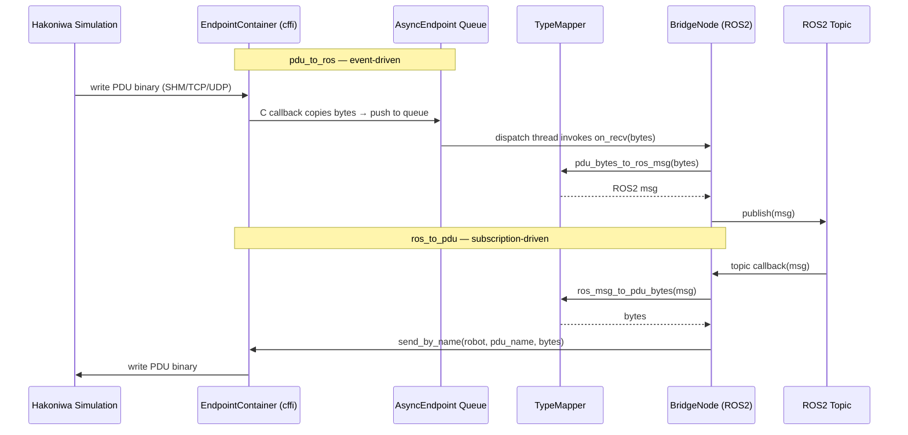

# hakoniwa-pdu-ros

**hakoniwa-pdu-ros** is a lightweight Python bridge between [hakoniwa-pdu-endpoint](https://github.com/hakoniwalab/hakoniwa-pdu-endpoint) and ROS topics.

## Overview

This package dynamically maps Hakoniwa PDU data to ROS topic messages and vice versa — no code generation required.

- **PDU → ROS**: Loads a `hakoniwa-pdu-endpoint`, receives incoming PDU data, and dynamically converts it into the corresponding ROS topic message.
- **ROS → PDU**: Subscribes to ROS topics and forwards the received messages directly into the endpoint.

Thanks to Python's dynamic typing, PDU fields are mapped to ROS message fields at runtime, keeping the bridge flexible and configuration-driven.

## Architecture



# hakoniwa-pdu-ros — Internal Design Document

## 1. Overview

This document describes the internal design of `hakoniwa-pdu-ros`,
intended as a specification detailed enough for automated code generation.

**Responsibilities:**
- Wrap `hakoniwa-pdu-endpoint` Python bindings (`cffi`-based) as the PDU I/O layer
- Dynamically map PDU binary data ↔ ROS2 message fields at runtime
- Bridge PDU endpoints and ROS2 topics based on a JSON config

---

## 2. Repository Structure

```
hakoniwa-pdu-ros/
├── hakoniwa_pdu_ros/
│   ├── __init__.py
│   ├── config_loader.py       # Load and validate JSON config
│   ├── pdu_endpoint.py        # Thin wrapper around hakoniwa_pdu_endpoint
│   ├── type_mapper.py         # Dynamic PDU ↔ ROS2 message field mapping
│   ├── bridge_node.py         # ROS2 Node: ties everything together
│   └── utils.py               # Helpers (logging, byte conversion, etc.)
├── config/
│   └── sample_bridge.json     # Sample config file
├── test/
│   ├── test_config_loader.py
│   ├── test_type_mapper.py
│   └── test_pdu_endpoint.py
├── setup.py
└── DESIGN.md                  # This document
```

---

## 3. Dependencies

| Package | Role |
|---|---|
| `hakoniwa_pdu_endpoint` | cffi-based Python bindings for `hakoniwa-pdu-endpoint` |
| `rclpy` | ROS2 Python client library |
| `cffi` | Required by `hakoniwa_pdu_endpoint` internally |

`hakoniwa_pdu_endpoint` must be installed from the `hakoniwa-pdu-endpoint`
repository before using this package:

```bash
# Build the core C++ library
cmake -S . -B build && cmake --build build -j4

# Build the cffi extension module
python3 python/hakoniwa_pdu_endpoint/build_c_endpoint_ffi.py

# Add to PYTHONPATH
export PYTHONPATH=/path/to/hakoniwa-pdu-endpoint/python:$PYTHONPATH
```

The following modules from `hakoniwa_pdu_endpoint` are used directly:

| Module | Role |
|---|---|
| `c_endpoint.py` | Thin cffi wrapper over the C facade |
| `c_endpoint_async.py` | Callback → Python queue → dispatch thread |
| `endpoint_container.py` | Lifecycle/config orchestration for multiple endpoints |

---

## 4. Config File Schema

Config file path is passed as a CLI argument or ROS2 parameter.

```json
{
  "container_config": "config/endpoint/container.json",
  "bridges": [
    {
      "name": "drone_pos",
      "direction": "pdu_to_ros",
      "robot_name": "Drone",
      "pdu_name": "pos",
      "ros_topic": "/hakoniwa/drone/pos",
      "ros_msg_type": "geometry_msgs/msg/Twist"
    },
    {
      "name": "drone_cmd",
      "direction": "ros_to_pdu",
      "robot_name": "Drone",
      "pdu_name": "cmd",
      "ros_topic": "/hakoniwa/drone/cmd",
      "ros_msg_type": "geometry_msgs/msg/Twist"
    }
  ]
}
```

**Field definitions:**

| Field | Type | Description |
|---|---|---|
| `container_config` | string | Path to `hakoniwa-pdu-endpoint` container JSON |
| `name` | string | Unique bridge identifier |
| `direction` | `"pdu_to_ros"` \| `"ros_to_pdu"` | Data flow direction |
| `robot_name` | string | Robot name (from pdudef.json) |
| `pdu_name` | string | PDU name (from pdudef.json) |
| `ros_topic` | string | ROS2 topic name |
| `ros_msg_type` | string | ROS2 message type (e.g. `geometry_msgs/msg/Twist`) |

---

## 5. Module Design

### 5.1 `config_loader.py`

```python
@dataclass
class BridgeConfig:
    name: str
    direction: str          # "pdu_to_ros" | "ros_to_pdu"
    robot_name: str
    pdu_name: str
    ros_topic: str
    ros_msg_type: str

@dataclass
class BridgeRootConfig:
    container_config: str
    bridges: list[BridgeConfig]

def load_config(path: str) -> BridgeRootConfig:
    """Load and validate the JSON config file.
    Raises ValueError on missing or invalid fields."""
```

---

### 5.2 `pdu_endpoint.py` — Wrapper around hakoniwa_pdu_endpoint

This module wraps `endpoint_container.py` and `c_endpoint_async.py`
from `hakoniwa_pdu_endpoint`. It does **not** re-implement the C ABI layer.

```python
from hakoniwa_pdu_endpoint.endpoint_container import EndpointContainer
from hakoniwa_pdu_endpoint.c_endpoint_async import AsyncEndpoint

class PduEndpointManager:
    """
    Lifecycle manager for all PDU endpoints.
    Wraps EndpointContainer for multi-endpoint orchestration.
    """
    def __init__(self, container_config_path: str): ...
    def start(self) -> None: ...
    def stop(self) -> None: ...

    def subscribe_recv(
        self,
        robot_name: str,
        pdu_name: str,
        callback: Callable[[bytes], None]
    ) -> None:
        """
        Register an event-driven callback for incoming PDU data.
        Uses c_endpoint_async internally:
          1. C callback captures and copies bytes
          2. Copied bytes are pushed to a Python queue
          3. A Python-owned dispatch thread invokes `callback`
        """

    def send(
        self,
        robot_name: str,
        pdu_name: str,
        data: bytes
    ) -> None:
        """Send PDU bytes via send_by_name on the resolved endpoint."""
```

**Callback safety note (from upstream design):**

The C-level callback only captures and copies the payload.
All Python handler logic runs on a Python-owned dispatch thread,
never on the transport-facing callback thread.

---

### 5.3 `type_mapper.py` — Dynamic type mapping

Dynamically imports ROS2 message types and maps PDU binary fields
to/from message fields using Python's `importlib` and `struct`.

```python
def import_ros_msg_class(ros_msg_type: str) -> type:
    """
    Dynamically import a ROS2 message class.
    e.g. "geometry_msgs/msg/Twist" → geometry_msgs.msg.Twist
    """

def pdu_bytes_to_ros_msg(data: bytes, ros_msg_type: str) -> object:
    """
    Convert raw PDU bytes to a ROS2 message instance.
    Fields are mapped by name using the message's
    __slots__ and _fields_and_field_types attributes.
    """

def ros_msg_to_pdu_bytes(msg: object, ros_msg_type: str) -> bytes:
    """
    Convert a ROS2 message instance to raw PDU bytes.
    Fields are serialized in the same order as the PDU layout.
    """
```

**Mapping strategy:**

1. Import the ROS2 message class via `importlib`
2. Inspect `__slots__` and `_fields_and_field_types` to build a flat list of `(field_name, c_type, byte_offset)`
3. At runtime, use `struct.pack` / `struct.unpack` for conversion
4. Nested message fields are handled recursively

---

### 5.4 `bridge_node.py` — ROS2 Node

```python
class HakoniwaRosBridgeNode(Node):
    def __init__(self, config_path: str):
        super().__init__("hakoniwa_pdu_ros_bridge")

        # 1. Load config
        cfg = load_config(config_path)

        # 2. Start endpoint manager
        self._manager = PduEndpointManager(cfg.container_config)
        self._manager.start()

        # 3. Wire up each bridge
        for bridge in cfg.bridges:
            if bridge.direction == "pdu_to_ros":
                self._setup_pdu_to_ros(bridge)
            elif bridge.direction == "ros_to_pdu":
                self._setup_ros_to_pdu(bridge)

    def _setup_pdu_to_ros(self, bridge: BridgeConfig) -> None:
        """
        Register event-driven PDU callback → convert → publish to ROS2 topic.
        No polling timer needed; driven by c_endpoint_async dispatch thread.
        """
        publisher = self.create_publisher(
            import_ros_msg_class(bridge.ros_msg_type),
            bridge.ros_topic,
            10
        )

        def on_recv(data: bytes) -> None:
            msg = pdu_bytes_to_ros_msg(data, bridge.ros_msg_type)
            publisher.publish(msg)

        self._manager.subscribe_recv(
            bridge.robot_name, bridge.pdu_name, on_recv
        )

    def _setup_ros_to_pdu(self, bridge: BridgeConfig) -> None:
        """
        Subscribe to ROS2 topic → convert → send to PDU endpoint.
        """
        def on_msg(msg) -> None:
            data = ros_msg_to_pdu_bytes(msg, bridge.ros_msg_type)
            self._manager.send(bridge.robot_name, bridge.pdu_name, data)

        self.create_subscription(
            import_ros_msg_class(bridge.ros_msg_type),
            bridge.ros_topic,
            on_msg,
            10
        )

    def destroy_node(self) -> None:
        self._manager.stop()
        super().destroy_node()
```

---

## 6. Data Flow



---

## 7. Threading Model

| Thread | Owner | Role |
|---|---|---|
| ROS2 executor thread | `rclpy` | Drives topic callbacks and node spin |
| PDU dispatch thread | `c_endpoint_async` | Invokes `on_recv` callbacks from Python queue |
| C transport thread | `hakoniwa-pdu-endpoint` | Handles raw network/SHM I/O, copies bytes only |

The C transport thread **never** runs Python code directly.
All Python logic runs on either the ROS2 executor thread or the PDU dispatch thread.

---

## 8. Error Handling Policy

| Situation | Behaviour |
|---|---|
| `hakoniwa_pdu_endpoint` not found | Raise `ImportError` at startup |
| Container config invalid | Raise `ValueError` at startup |
| `recv` callback receives empty bytes | Skip publish, log `DEBUG` |
| Type mapping mismatch | Log `WARN`, skip that event |
| Endpoint send failure | Log `ERROR`, continue running |

---

## 9. Entry Point

```bash
ros2 run hakoniwa_pdu_ros bridge --config config/sample_bridge.json
```

```python
# hakoniwa_pdu_ros/__main__.py
import rclpy
from hakoniwa_pdu_ros.bridge_node import HakoniwaRosBridgeNode

def main():
    rclpy.init()
    node = HakoniwaRosBridgeNode(config_path=get_config_arg())
    try:
        rclpy.spin(node)
    finally:
        node.destroy_node()
        rclpy.shutdown()
```
